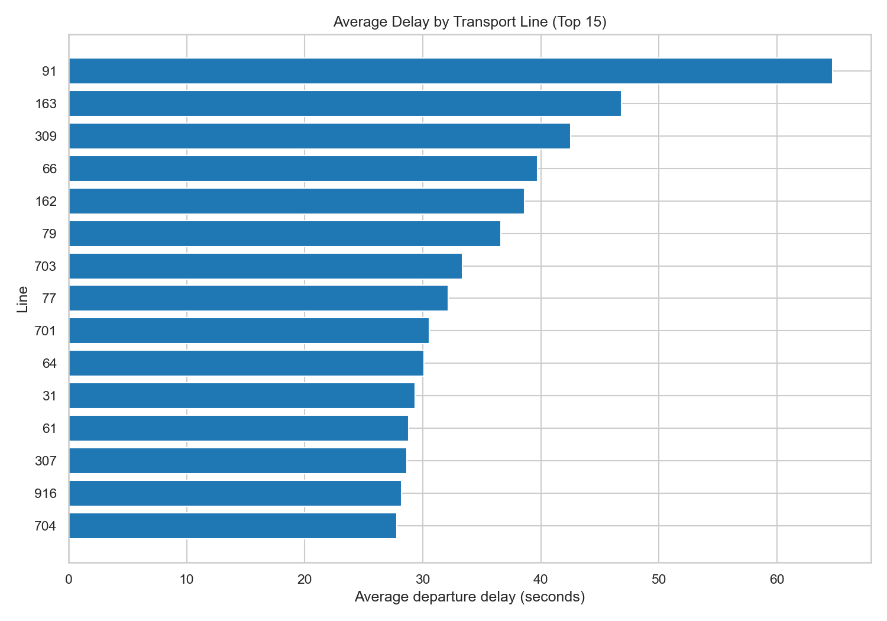
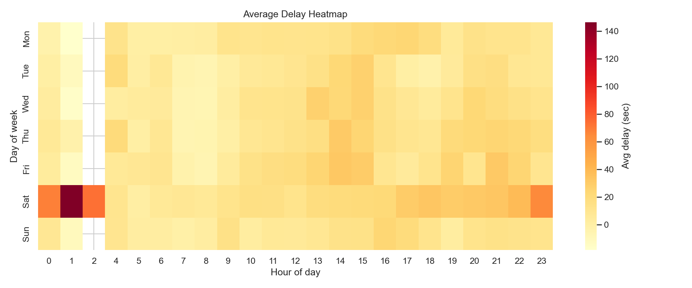

# Zurich Transport Delay Analysis

End-to-end **data analytics project** analyzing operational delay patterns in **Zurich public transport (VBZ)** using Python and SQL.

The project processes **1.4M+ trip-segment records** to identify delay hotspots across lines, stops, and time-of-day.

---

## Project Objective

Analyze operational transport data to understand:

- where delays happen most often
- when delays are most frequent
- which lines and stops are most affected
- how actual travel time differs from scheduled time
- whether delays increase over time

---

## Dataset

**Source**

The dataset comes from Zurich Open Data (VBZ transport delay records). It contains operational records for public transport trip segments, including scheduled and actual departure/arrival timestamps.

**Location in repository**

`data/raw/vbz_delays_original.csv`

**Coverage**

- Period: 2022-12-25 to 2022-12-31
- Volume: **1,402,968 trip segments**
- Grain: trip-segment operational records

**Key raw fields (as provided in the source file)**

- `linie`
- `halt_kurz_von1`
- `halt_kurz_nach1`
- `soll_ab_von`
- `ist_ab_von`
- `soll_an_nach`
- `ist_an_nach1`

---

## Methodology

The analysis follows a reproducible data pipeline:

1. **Data cleaning and feature engineering (Python)**
   - handling missing timestamps
   - computing delay metrics
2. **Structured storage (SQLite)**
   - storing cleaned dataset
   - enabling SQL-based analysis
3. **Analytical queries (SQL)**
   - aggregations answering business questions
4. **Visualization and reporting**
   - charts exported as PNG
   - summary tables exported as CSV

---

## Engineered Metrics

| Metric | Description |
| --- | --- |
| `departure_delay_sec` | actual departure minus scheduled departure |
| `arrival_delay_sec` | actual arrival minus scheduled arrival |
| `scheduled_travel_sec` | planned travel time |
| `actual_travel_sec` | observed travel time |
| `travel_time_diff_sec` | actual minus scheduled travel time |
| `departure_hour` | hour extracted from departure time |

---

## Example SQL Query

Example aggregation used in the analysis:

```sql
SELECT
    linie,
    AVG(departure_delay_sec) AS avg_delay_sec,
    COUNT(*) AS trip_segments
FROM delays_clean
GROUP BY linie
ORDER BY avg_delay_sec DESC
LIMIT 10;
```

This query identifies transport lines with the highest average departure delay.

---

## Key Findings

**Delay by Line**

Most delay-prone lines (average departure delay):

- Line 91: 64.74 sec
- Line 163: 46.85 sec
- Line 309: 42.52 sec

High-volume lines with relevant delay burden:

- Line 31: 64,488 segments, 29.34 sec average delay
- Line 32: 49,212 segments, 23.47 sec average delay

**Delay by Time of Day**

Highest delay rates:

- 02:00: 75.36%
- 01:00: 69.09%

Among high-volume daytime periods:

- 14:00 to 15:00 shows elevated delay rates (60%+)

Note: night hours show higher delay rates due to low service frequency, so percentages should be interpreted with caution.

**Delay by Stop**

Stops with highest delay rates (minimum 500 departures):

- BWEI: 92.19%
- BDIE: 90.47%
- ITFA: 89.04%

**Travel Time Gap**

Lines with largest difference between actual and scheduled travel time:

- Line 307: 11.82 sec
- Line 309: 11.33 sec
- Line 91: 11.21 sec

**Weekly Delay Trend**

Average delay increased significantly on 2022-12-31:

- First 6 days average: 11.00 sec
- 2022-12-31: 28.68 sec

This suggests end-of-year operational pressure on the network.

---

## Visuals

**Delay by Line**



**Average Delay Heatmap**



---

## Tech Stack

**Python**

- pandas
- numpy
- matplotlib
- seaborn

**Database**

- SQLite

**Tools**

- Jupyter Notebook
- Git and GitHub

---

## Repository Structure

```text
zurich-transport-delay-analysis/
|
|-- data/
|   |-- raw/
|   |   `-- vbz_delays_original.csv
|   `-- processed/
|       |-- vbz_delays_clean.csv
|       |-- vbz_delays.db
|       |-- q1_delay_by_line.csv
|       |-- q2_delay_by_hour.csv
|       |-- q3_delay_by_stop.csv
|       |-- q4_travel_time_diff.csv
|       `-- q5_delay_trend.csv
|
|-- notebooks/
|   |-- 01_data_cleaning.ipynb
|   |-- 02_exploratory_analysis.ipynb
|   `-- 03_delay_analysis.ipynb
|
|-- visuals/
|   |-- delay_by_line.png
|   |-- delay_by_hour.png
|   `-- delay_heatmap.png
|
|-- src/
|   |-- cleaning.py
|   `-- analysis.py
|
|-- README.md
|-- requirements.txt
`-- .gitignore
```

---

## How to Reproduce the Analysis

Install dependencies:

```bash
pip install -r requirements.txt
```

Run the pipeline:

```bash
python src/cleaning.py
python src/analysis.py
```

Outputs will be generated in:

- `data/processed/`
- `visuals/`

---

## Output Artifacts

Generated outputs include:

**Datasets**

- `vbz_delays_clean.csv`
- SQLite database with indexed tables

**Analytical summaries**

- delay by line
- delay by hour
- delay by stop
- travel time difference
- weekly delay trend

**Visual reports**

- delay by line
- delay by hour
- delay heatmap

---

## Skills Demonstrated

- Data cleaning of large operational datasets (1.4M+ rows)
- Feature engineering for delay metrics
- SQL aggregation queries for operational KPIs
- Exploratory data analysis with pandas
- Reproducible data pipelines
- Analytical reporting with visualizations

---

## CV-Ready Bullet Points

- Built an end-to-end transport delay analytics pipeline (Python and SQLite) processing 1.4M+ VBZ trip-segment records.
- Developed SQL-driven analyses identifying delay hotspots by line, stop, and time-of-day.
- Quantified actual versus scheduled travel-time gaps and detected a significant delay spike on 2022-12-31.
- Produced clean datasets, indexed databases, analytical tables, and visual reports from raw operational data.

---

## Note on Large Data Files

To keep the repository lightweight and compatible with GitHub size limits, the following files are excluded from version control:

- `data/raw/vbz_delays_original.csv`
- `data/processed/vbz_delays_clean.csv`
- `data/processed/vbz_delays.db`

Included in the repository:

- reproducible pipeline (`src/`)
- analysis notebooks (`notebooks/`)
- summary outputs
- visualizations

To reproduce the results, place the raw dataset in `data/raw/` and run:

```bash
python src/cleaning.py
python src/analysis.py
```